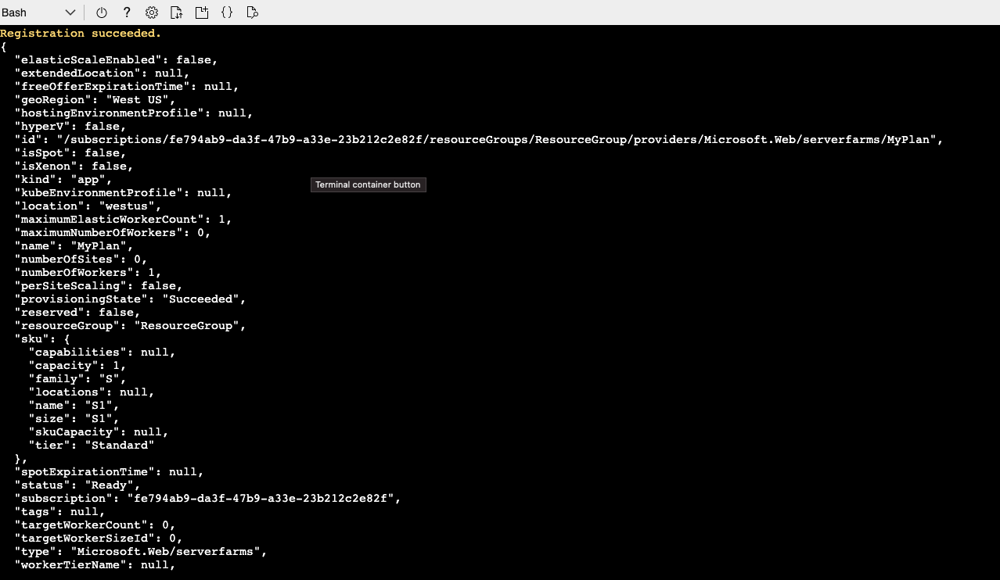
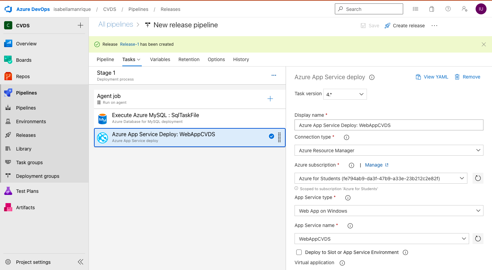
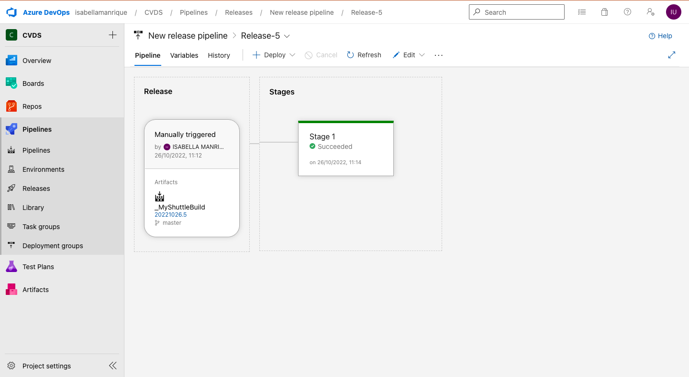

# Laboratorio CI/CD

## Integrantes: Santiago Ospina, Isabella Manrique

## Ejercicio 1
Primero, en [Azure portal](https://portal.azure.com/#home), abriremos
el Azure Cloud Shell que nos servira como terminal.


Luego, podremos desplegar un grupo de recursos con el siguiente comando:
```
az group create --name ResourceGroup --location westus
```


Ahora crearemos una App Service Plan con el siguiente comando:
```
az appservice plan create --resource-group ResourceGroup --name MyPlan --sku S1
```


Para crear una Web App, insertaremos el siguiente comando. El nombre debe ser unico:
```
az webapp create --resource-group ResourceGroup --plan MyPlan --name WebAppCVDS
```


Y por ultimo crearemos el servidor de MySQL con un nombre unico
```
az mysql server create --resource-group ResourceGroup --name mySQLserverCVDS --admin-user mysqldbuser --admin-password P2ssw0rd@123 --sku-name GP_Gen5_2
```

Ahora podremos ver en los recursos el servidor que creamos.


Es importante que podamos guardar el nombre del servidor y el name login de esta:


Luego, en las configuraciones de seguridad permitiremos a los servicios de Azure hacer uso de este recurso:


## Ejercicio 2

Actualizaremos la informacion de la Weeb App, ajustado a java:


Despues de eso podremos ver que el servicio esta activo y se muestra asi:


Para conectarnos con la base de datos, tendremos que crear un nuevo hilo de conexion con las configuraciones de creacion del servidor de MySQL
que creamos antes:


## Ejercicio 3

Ahora, iremos al [Demo Generator](https://azuredevopsdemogenerator.azurewebsites.net/?TemplateId=77371&Name=MyShuttle) y crearemos un ambiente con la plantilla de
MyShuttle y alli entraremos a la opcion de Pipelines:


Buscaremos la opcion de 'MyShuttleBuild' y la editaremos con las siguientes configuraciones:


Despues de que se haya ejecutado de forma correcta, iremos a la parte de 'Releases':


Ahora editaremos la parte de MyShuttleRelease y agregaremos el artefacto de MyShuttleBuild:


Editaremos la primera etapa con ambas tareas y llenaremos los campos requeridos para poder continuar:



Ejecutamos el Pipeline que acabamos de editar con la opcion de create release:


Si todo esta configurado de forma correcta, se ejecutara con exito:


https://webappcvds.azurewebsites.net/CVDS
